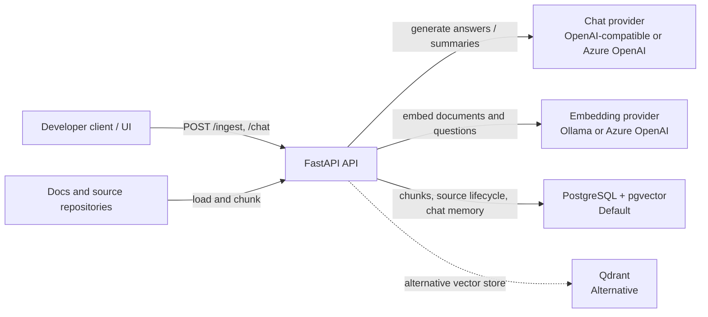
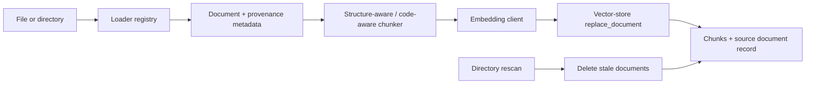
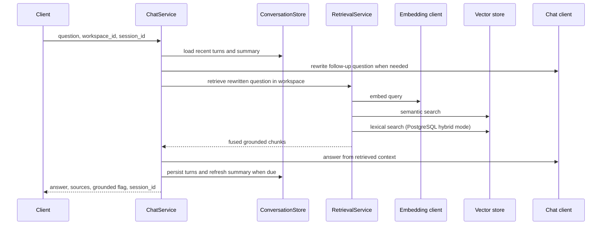

# Architecture

## Purpose

Developer RAG Service is a Python 3.14 FastAPI backend for indexing internal developer documentation and source code, then answering questions only from retrieved evidence. PostgreSQL with pgvector is the default persistent store; Qdrant remains a supported alternative.

The design keeps answer generation and embedding generation separate. This is intentional: a chat model must never be assumed to provide embeddings, and retrieval must not depend on the chat provider.

## System Context

## API Surface

| Endpoint | Responsibility |
| --- | --- |
| `POST /ingest` | Loads one file or a directory, chunks supported content, embeds chunks, and synchronizes the selected workspace. |
| `POST /chat` | Retrieves workspace-scoped evidence, generates a grounded answer, returns sources, and maintains session memory. |
| `GET /health` | Returns process-level health and configured environment. |
| `GET /readiness` | Checks vector-store reachability and reports configured provider/model details. |

`workspace_id` is optional on ingestion and chat. When omitted, the configured `DEFAULT_WORKSPACE_ID` is used.

## Ingestion and Source Lifecycle

The loader registry supports Markdown, HTML, plain text, PDF, Python, Java, Kotlin, and common configuration/code extensions. Loaders preserve source path, title, type, and relevant metadata.

- Python files are chunked by module, class, and function using the Python AST.
- Java files use Tree-sitter to preserve package/type/member symbols and line ranges; malformed Java falls back to generic text chunking.
- Kotlin (`.kt`, `.kts`) retains language and repository metadata but currently uses generic chunking.
- Documents retain provenance-rich metadata, including source path, repository details when available, language/symbol information for code, line ranges, workspace ID, and chunk position.

For PostgreSQL, `rag.source_documents` records a content hash per `(workspace_id, doc_id)`. During rescans, unchanged files are skipped, changed files replace their old chunks, and documents missing from the scanned root are removed. This prevents stale chunks from remaining retrievable.

## Retrieval and Answering

`RetrievalService` embeds the question through the embedding adapter, then filters semantic matches below `MIN_RETRIEVAL_SCORE`. PostgreSQL hybrid search adds full-text results and combines semantic and lexical ranks using reciprocal rank fusion. Set `HYBRID_SEARCH_ENABLED=false` for semantic-only retrieval.

If no evidence remains after retrieval, the service returns an explicit abstention instead of calling the chat model for an ungrounded answer. Grounded responses include structured source references with document/chunk IDs, source path, score, and snippet.

## Conversation Memory

Conversation memory is separate from the document index and is never embedded as document knowledge.

- PostgreSQL deployments use durable conversation turns and summaries shared by API workers.
- Qdrant/local fallback uses a shared in-memory conversation store.
- A session summary is refreshed after `MEMORY_SUMMARY_AFTER_TURNS` new turns.
- `MEMORY_MAX_TURNS` limits the recent turn window; `MEMORY_RETENTION_DAYS` controls PostgreSQL retention.

## Provider and Storage Boundaries

| Concern | Default | Alternatives | Boundary |
| --- | --- | --- | --- |
| Chat generation | OpenAI-compatible endpoint | Azure OpenAI | `ChatClient` adapter |
| Embeddings | Ollama | Azure OpenAI | `EmbeddingClient` adapter |
| Vector storage | PostgreSQL + pgvector | Qdrant | `VectorStore` adapter |
| Lexical retrieval | PostgreSQL full-text search | Not required for Qdrant | `LexicalSearchVectorStore` capability |
| Conversation memory | PostgreSQL | In-memory fallback | `ConversationStore` adapter |

Configuration is centralized in `app.config.Settings`. Provider-specific URLs, credentials, models, timeouts, vector dimensions, retrieval tuning, and memory settings are environment-driven. The repository `.env` is intentionally not committed; `.env.example` describes the supported settings.

## Persistence Model

The default pgvector store uses:

- `rag.document_chunks` for chunk text, embeddings, provenance metadata, and lexical indexes;
- `rag.source_documents` for workspace-scoped source lifecycle records;
- `rag.conversation_turns` and `rag.conversation_summaries` for durable chat memory.

Embeddings use 768 dimensions by default for `nomic-embed-text`; the configured `PG_VECTOR_DIM` must match the active embedding model.

## Testing and Validation

The normal pytest suite uses mocks and in-process FastAPI transport, so it does not require a running API, model endpoint, Qdrant, or PostgreSQL instance.

`tests/integration/test_live_stack.py` is opt-in (`RUN_LIVE_INTEGRATION=1`). It calls an already-running local API and verifies readiness, ingestion, embedding, pgvector retrieval, grounded chat sources, workspace isolation, and cleanup. See [testing.md](testing.md) for exact commands and PyCharm configuration.

## Current Boundaries and Planned Work

- Kotlin symbol-aware parsing is deferred until Kotlin retrieval becomes a primary use case.
- Reranking remains configuration-visible but is not yet an active retrieval stage.
- The next approved improvements are tracked in [next_phase.md](next_phase.md), rather than as an outdated architecture gap list.
